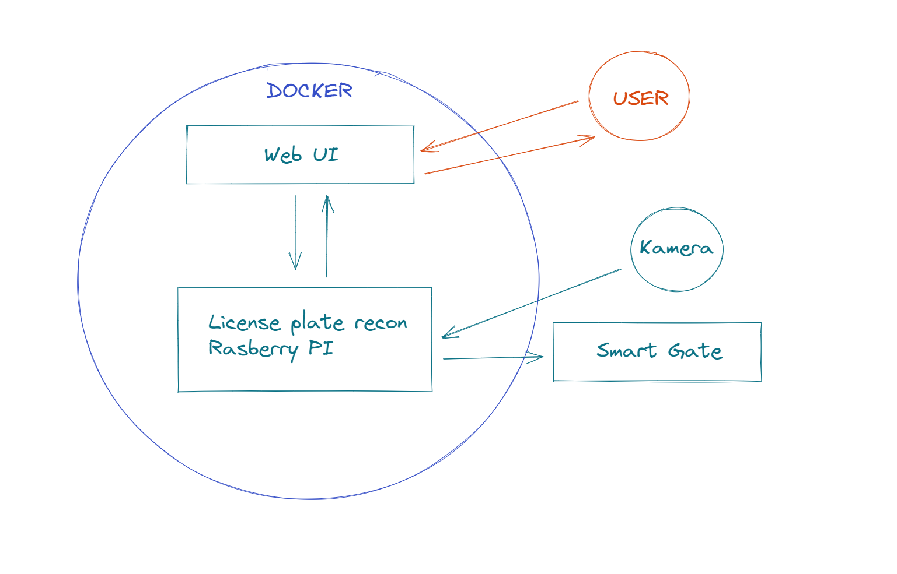

# smart-gate

Project for building a "smart gate" that open it self when a valid number plate is read by the camera. 

## Hardware
  * [Rasberry Pi 3b+](https://www.raspberrypi.com/products/raspberry-pi-3-model-b-plus/)
  * [Rasberry Pi Camera v2](https://www.raspberrypi.com/products/camera-module-v2/)
  * [Relay Card](https://www.amazon.se/Paradisetronic-com-2-Kanal-Relais-Modul-Relay-Module-Optokoppler-Status-LEDs/dp/B01EQAJP2I/ref=sr_1_15?crid=1XJGZB93JGYAR&keywords=relay+card&qid=1662572364&sprefix=relay+card%2Caps%2C101&sr=8-15)

## Software
* Python, for interacting with the raspberry and image processing + recognition. Also use [FastAPI](https://fastapi.tiangolo.com/) to build a API for the web UI to interact with.
* [Next.js](https://nextjs.org/), for building an web UI to view a live video feed from the camera, managing number plates and open/close gate from.
* [Docker](https://www.docker.com/) for easy deploy to the raspberry pi
 
 
 
## First draft 

